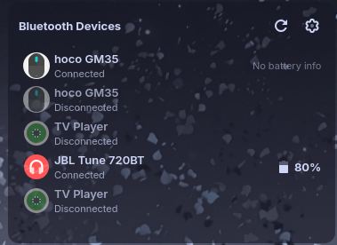

# BatSignal - Bluetooth Battery Widget for KDE Plasma

A KDE Plasma widget that monitors and displays battery levels for connected Bluetooth devices using the BlueZ DBus interface.


> [!WARNING]
> **Experimental C++ Plugin Required**: This widget now uses a C++ plugin for DBus communication (replacing the deprecated QtDBus QML module in Plasma 6).
> You must build and install the plugin manually before the widget will work. See the [Installation](#installation) section.

> [!CAUTION]
> **BlueZ Experimental Features**: This widget requires BlueZ experimental features (`bluez` flag `-E`) to read battery levels. Enabling this may affect Bluetooth stability on some systems.

## Features

- 📊 **Real-time Battery Monitoring**: Track battery levels of all connected Bluetooth devices
- 🔋 **Visual Indicators**: Color-coded battery icons and percentage displays
- 🔔 **Low Battery Notifications**: Get alerted when device batteries run low
- ⚙️ **Configurable**: Customize update intervals, thresholds, and display options
- 📱 **Dual Views**: Compact panel icon and detailed expanded view
- 🎯 **Smart Filtering**: Option to show only devices with battery support

## Screenshots

### Panel View (Compact)
The widget shows a battery icon in your panel with a badge indicating the number of devices being monitored.

### Expanded View (Full)

Click the panel icon to see a detailed list of all Bluetooth devices with their battery levels, connection status, and device information.

## Requirements

- KDE Plasma 5.x or 6.x
- BlueZ 5.x with **experimental features enabled**
- Qt 5.15+ or Qt 6.x
- DBus support

## Installation

### Prerequisites: Enable BlueZ Experimental Features

This widget requires BlueZ experimental features to access battery information. Run the included helper script:

```bash
sudo ./enable-bluez-experimental.sh enable
```

This will:
- Backup your current BlueZ configuration
- Enable experimental features in `/etc/bluetooth/main.conf`
- Restart the Bluetooth service

To check the status at any time:
```bash
./enable-bluez-experimental.sh status
```

### Install the Widget

Run the installation script:

```bash
./install.sh
```

Or manually using CMake (standard KDE method):

```bash
mkdir build && cd build
cmake .. -DCMAKE_INSTALL_PREFIX=/usr
make
sudo make install
```

### Build Requirements
- CMake
- Extra CMake Modules (ECM)
- Qt 6 (Core, Qml, DBus)
- KDE Frameworks 6

## Usage

1. **Add the Widget**:
   - Right-click on your panel or desktop
   - Select "Add Widgets..."
   - Search for "BatSignal"
   - Drag it to your desired location

2. **Configure**:
   - Right-click the widget and select "Configure BatSignal..."
   - Adjust settings:
     - **Update Interval**: How often to refresh battery levels (5-300 seconds)
     - **Filter Devices**: Show only devices with battery support
     - **Low Battery Threshold**: When to trigger warnings (5-50%)
     - **Notifications**: Enable/disable low battery alerts

3. **Monitor Your Devices**:
   - The panel icon shows the lowest battery level among connected devices
   - Click to expand and see all devices
   - Hover for a quick tooltip summary

## Configuration Options

| Setting | Description | Default |
|---------|-------------|---------|
| Update Interval | How often to poll battery levels | 30 seconds |
| Show Only Battery Devices | Filter out devices without battery info | Off |
| Low Battery Threshold | Percentage to trigger warnings | 20% |
| Enable Notifications | Show system notifications for low battery | On |

## Troubleshooting

### No Battery Information Showing

1. **Check Experimental Features**:
   ```bash
   ./enable-bluez-experimental.sh status
   ```
   If disabled, enable with:
   ```bash
   sudo ./enable-bluez-experimental.sh enable
   ```

2. **Verify Device Support**: Not all Bluetooth devices report battery levels. The widget will show "No battery info" for devices that don't support this feature.

3. **Reconnect Devices**: After enabling experimental features, you may need to disconnect and reconnect your Bluetooth devices.

### Widget Not Appearing

1. **Restart Plasma Shell**:
   ```bash
   killall plasmashell && plasmashell &
   ```

2. **Check Installation**:
   ```bash
   kpackagetool6 --type=Plasma/Applet --show=org.kde.plasma.batsignal
   ```

### DBus Errors

If you see DBus-related errors:
1. Ensure BlueZ service is running:
   ```bash
   systemctl status bluetooth
   ```
2. Check if your user has DBus access
3. Verify experimental features are enabled

## Uninstallation

**For Plasma 6:**
```bash
kpackagetool6 --type=Plasma/Applet --remove org.kde.plasma.batsignal
```

**For Plasma 5:**
```bash
kpackagetool5 --type=Plasma/Applet --remove org.kde.plasma.batsignal
```

To disable experimental features (if you no longer need them):
```bash
sudo ./enable-bluez-experimental.sh disable
```

## Development

### Testing

Test the widget without installing:
```bash
plasmoidviewer -a package
```

### Project Structure

```
batsignal/
├── package/
│   ├── metadata.json              # Widget metadata
│   └── contents/
│       ├── ui/
│       │   ├── main.qml           # Main widget UI
│       │   ├── BluetoothBattery.qml  # DBus integration
│       │   └── ConfigGeneral.qml  # Configuration UI
│       └── config/
│           ├── main.xml           # Config schema
│           └── config.qml         # Config structure
├── enable-bluez-experimental.sh   # Helper script
├── install.sh                     # Installation script
└── README.md                      # This file
```

## Technical Details

### DBus Interface

The widget uses the BlueZ DBus API to query device information:
- **Service**: `org.bluez`
- **Interface**: `org.bluez.Battery1` (requires experimental features)
- **Method**: `GetManagedObjects` on `org.freedesktop.DBus.ObjectManager`

### Battery Levels

Battery percentages are retrieved from the `Percentage` property of the `org.bluez.Battery1` interface. This interface is only available when:
1. BlueZ experimental features are enabled
2. The Bluetooth device supports battery reporting (typically BLE devices)

## Contributing

Contributions are welcome! Feel free to:
- Report bugs
- Suggest features
- Submit pull requests

## License

This project is licensed under the GPL-3.0 License.

## Credits

Developed for KDE Plasma desktop environment.

## Support

If you encounter issues:
1. Check the troubleshooting section above
2. Verify BlueZ experimental features are enabled
3. Check system logs: `journalctl -u bluetooth`
4. Ensure your Bluetooth devices support battery reporting

---

**Note**: This widget requires BlueZ experimental features, which may have stability implications. Use at your own discretion.
